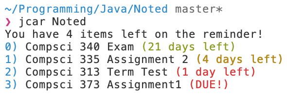

<div align="center">
<h3>Noted</h3>


</div>

## Overview
This program is almost functionally the same as [py-todo](https://github.com/aesophor/py-todo/) however it is writen in Java
as an excerise for my own learning.

Data is simply stored in the data.csv file, which is then converted into an ArrayList during normal execution.


## Dependencies
* Java

## Supported Platforms
* OSX (tested on 10.14 Mojave)

## Installation
* TODO, program is not yet packaged and must be manually compiled and added to PATH.

## Usage
```
<<<<<<< HEAD
$a -add               #Add a new item.");
$r -remove <index>    #Remove an item by index.");
$l -list              #List all items");
$h -help              #Display help message");
=======
$a -add               #Add a new item
$r -remove <index>    #Remove an item by index
$l -list              #List all items
$h -help              #Display help message
>>>>>>> dev
```

## Configuration
TODO

## Contributors
* [BMFirman](https://github.com/BMFirman/)
<<<<<<< HEAD
Special thanks again to [Aesophor](https://github.com/aesophor/) for providing an excelent tool to replicate :) 
=======
Special thanks again to [Aesophor](https://github.com/aesophor/) for providing an excelent tool to replicate :) 
>>>>>>> dev
